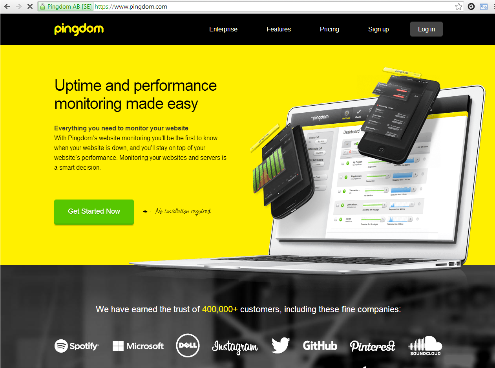
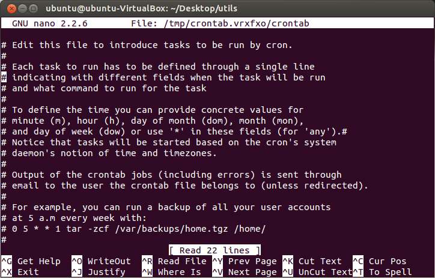
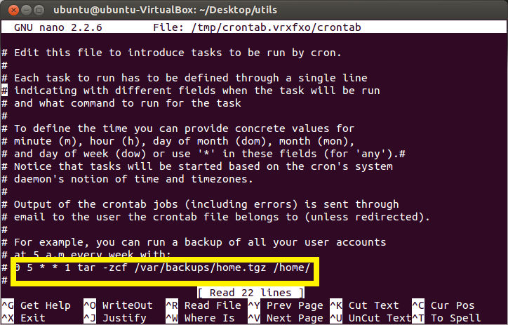
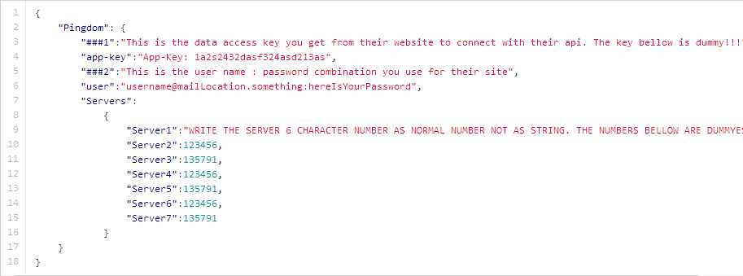
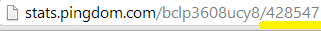
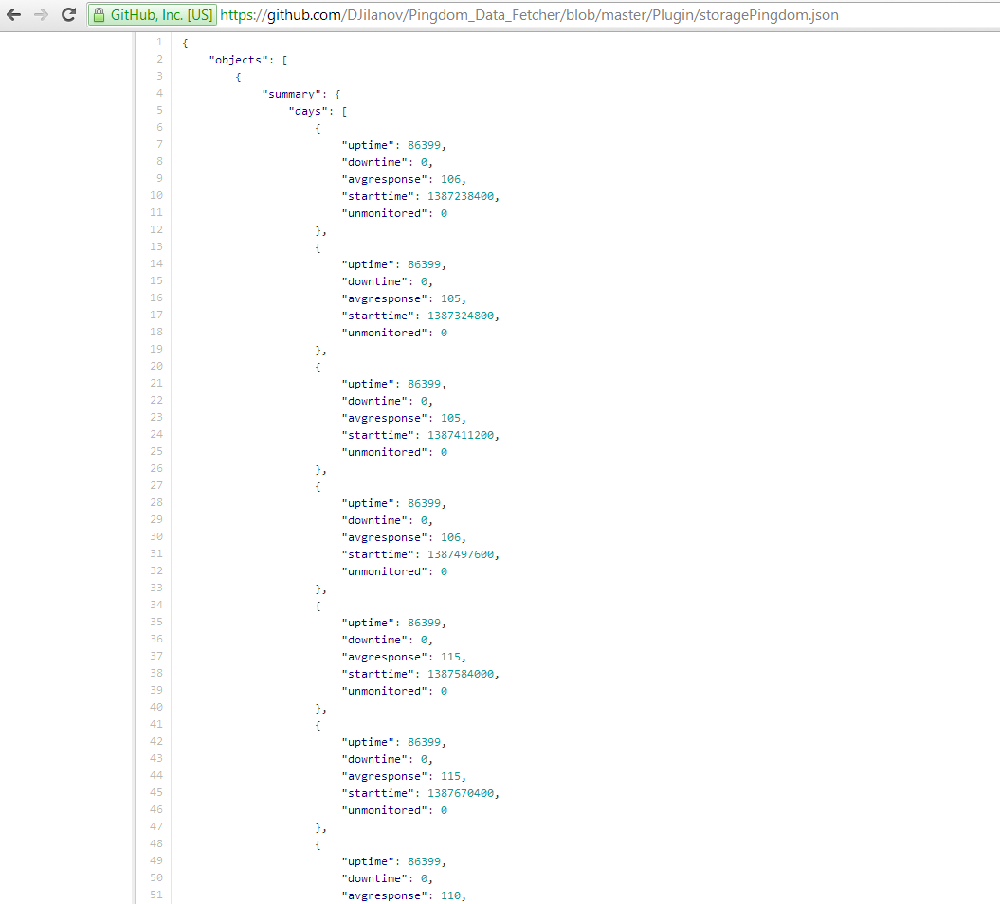

#Description

The easy configurable php data fetcher that can get all the info for your monitored servers directly from Pingdom API

##When to use

The mainly reason i made that plugin was because i lost few days searching in the net how to get the info directly from their API becouse i realy dont like their public status page... And in the end i had to read whole bunch of bad written documentation. I dont want you to do the same thing so ... just use the plugin ;) It is quite easy to be used. Set the cron how often you want to pick the data and just use it in your custom made status page ;)

* Supports almost all of the servers ( use php curl that is basicly set on every Unix machine )
* Supports easy to be handled ( just set the cron job that ill explain later and it auto fetch the data and save it 
* Can be used on every Web page
* Customizable style ( its explained to lowest level so even whitout programing knowage you can do it ! )

### Installation

1. Go to the Terminal. 

2. Type "crontab -e" and choose nano.

3. You will see this field

4. You will see that row

Where each value is for,

1. Minute (0-59)
2. Hours (0-23)
3. Day (0-31)
4. Month (0-12 [12 == December])
5. Day of the week(0-7 [7 or 0 == sunday])
/path/to/command - Script or command name to schedule

5. Set the main php script that is into Plugin/get_pingdom_data.php to be runned atleast 1 time daily.

6. You actualy set eveyrhing the script needs to run. Now you just need to put your info into the settings.json that looks like this:

7. There is inline documentation but ill still explain what to do.
7.1. The row under comment 1 is app-key. You must get it from your Pingdom acc and put it here.
7.2. The row under comment 2 is user. You must first time your username then the symbol ":" and then your password next to it.
7.3. In the servers tab you type only the last numbers here and leave only the amounth of servers you need ( add or remove rows in the json )

7.4. If you want to change something first be sure you know what is JSON and if you dont know read here http://en.wikipedia.org/wiki/JSON

#### Example Usage

The result will be into the Plugin/storagePingdom.json that looks like this.

where there is summary for each server. Into days there are the 10 days that pingdom returns you. Uptime is the total uptime for the day into seconds ( unix time ) , avgresponse is the average calltime and startime shows when the day started.

## Requirements

* PHP
* CURL
* CRON

## Contact

[Dimitar Jilanov](http://jilanov.com)   
[@DimitarJilanov](https://twitter.com/DimiturJilanov)
[@DimitarJilanov](https://www.facebook.com/djilanov)

## License

Pingdom Data Fetcher is available under the MIT license. See the LICENSE file for more info.
